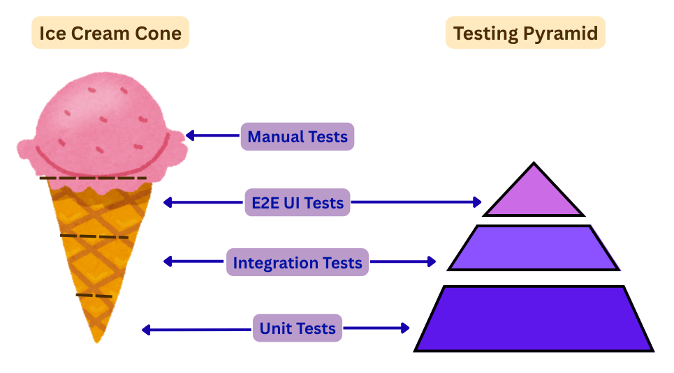

## Зачем нужны тесты

Автоматизированное тестирование кажется дополнительной работой, но правильно настроенное — экономит время в долгосроке. Проще найти ошибку локально, чем получать звонки в 2 часа ночи из-за поломки на продакшене.

**Главное:** время на тесты окупается при поддержке и развитии проекта.

## Статический анализ — фундамент

Инструменты вроде TypeScript, ESLint и PHPStan отлавливают ошибки типов и синтаксиса. Но даже строгая типизация не проверяет бизнес-логику — для этого нужны тесты.

**Статический анализ — самый дешёвый способ найти ошибки.** Начинайте с него.

## Почему 100% покрытие — плохая идея

Требование полного покрытия кода часто вредит:

- После ~70% наступает убывающая отдача: вы тестируете тривиальный код без логики
- Замедляет команду и усложняет рефакторинг
- Создаёт иллюзию безопасности — тесты есть, но проверяют не то, что важно

**Исключение:** публичные библиотеки, где поломка затронет чужие проекты.

## Три подхода к стратегии тестирования

Нет единственной «правильной» стратегии — выбор зависит от типа проекта и зрелости команды. Три основные модели:

### 1. Ice Cream Cone — ручная QA-культура (большинство проектов)

```
        ╱   Manual   ╲  ← ручное тестирование — верхний шар
       ╱──────────────╲
      ╱      E2E      ╲  ← много UI-тестов
     ╱──────────────────╲
    ╱   Интеграционные   ╲  ← мало
   ╱──────────────────────╲
  ╱     Unit-тесты (или их нет) ╲
 ╱────────────────────────────────╲
```

Большая часть усилий на ручном тестировании и E2E, минимум — на unit и интеграционных. Это реальность для большинства проектов в индустрии — особенно WordPress, где нетехнические QA-команды проверяют плагины и темы вручную.



**Когда это рабочий подход:**
- В команде есть QA-тестировщики с ручной культурой
- Проект — веб-сайт, интернет-магазин, кастомная тема — а не библиотека
- Клиентские проекты с ограниченными сроками и бюджетом
- Основная ценность — человеческая оценка UX, а не формальное покрытие

**Риски при масштабировании:**
- Обратная связь медленная — баг живёт до ручного тестирования
- E2E-тесты хрупкие — ломаются от мелких изменений UI
- С ростом проекта ручное тестирование становится бутылочным горлышком

### 2. Трофей тестирования — без ручных QA (автоматизация во главе)

```
        ╱   E2E    ╲
       ╱────────────╲
      ╱ Интеграционные ╲  ← главный фокус
     ╱──────────────────╲
    ╱    Unit-тесты      ╲
   ╱──────────────────────╲
  ╱   Статический анализ   ╲
 ╱──────────────────────────╲
```

Современный подход (Kent C. Dodds): статический анализ в основе, основной упор на интеграционные тесты, unit-тесты только для сложной логики, E2E — для критических путей.

**Когда выбирать:**
- В команде нет выделенных QA-тестировщиков — разработчики сами отвечают за качество
- Продуктовые проекты (SaaS, собственные плагины) с долгосрочной поддержкой
- Команда готова инвестировать в автоматизацию
- WordPress-плагины с регулярными релизами и обратной совместимостью

**Преимущества:**
- Быстрая обратная связь в CI/CD
- Снижение стоимости поддержки при развитии
- Стабильность при рефакторинге

### 3. Классическая пирамида — для библиотек и фреймворков

```
        ╱  E2E  ╲
       ╱─────────╲
      ╱ Интеграц. ╲
     ╱─────────────╲
    ╱   Unit-тесты  ╲
   ╱─────────────────╲
```

Широкое основание из unit-тестов, средний слой интеграционных, узкая верхушка E2E. Классика из мира системной разработки.

**Когда выбирать:**
- Библиотеки, пакеты и фреймворки, которые используются другими разработчиками
- Публичные npm/packagist-пакеты — поломка затронет чужие проекты
- Компоненты с изолированной бизнес-логикой (парсеры, валидаторы, алгоритмы)
- Команды, практикующие TDD

**Ограничения:** много моков снижает уверенность, не ловит проблемы интеграции. Для типовых веб-проектов избыточен.

### Как выбрать

| Контекст | Подход |
|----------|--------|
| Клиентский WP-проект, есть QA-команда | **Ice Cream Cone** |
| Продуктовый плагин, нет QA, есть DevOps | **Трофей** |
| Публичная библиотека / пакет / фреймворк | **Пирамида** |
| Переход: есть QA, хочу автоматизацию | Ice Cream Cone → Трофей |

## Почему интеграционные тесты дают лучший ROI

**Интеграционные тесты дают лучший баланс между уверенностью и затратами.** Они проверяют взаимодействие компонентов — это важнее, чем изолированная работа отдельных частей.

### Меньше моков — больше реальности

- **Не мокайте всё подряд** — моки убирают уверенность в интеграции
- **Реальные данные вместо mocks** — кроме критичных операций (отправка email, списание денег)

## Четыре принципа эффективного тестирования

1. **Тестируйте поведение, а не реализацию** — при рефакторинге тесты не должны ломаться. Если поменяли внутренности, но поведение то же — тесты проходят.

2. **Фокус на интеграции** — проверяйте совместную работу компонентов. Два идеально работающих по-отдельности компонента могут сломаться при взаимодействии.

3. **Разумное покрытие** — не гонитесь за 100% любой ценой. Лучше 60% покрытия критических сценариев, чем 100% тривиальных геттеров и сеттеров.

4. **Критические сценарии** — E2E-тесты для главных пользовательских путей: регистрация, создание заказа, оформление подписки.

## Что тестировать в WordPress-проектах

### Приоритет #1 — бизнес-логика плагина

- Регистрация кастомных типов записей и таксономий
- Обработка данных форм и мета-полей
- Синхронизация с внешними API
- Хуки, меняющие поведение ядра или WooCommerce

### Приоритет #2 — интеграции

- Плагин + WooCommerce (цены, товары, заказы)
- Плагин + внешний API (парсинг ответов, обработка ошибок)
- Плагин + другой плагин (совместимость)

### Приоритет #3 — критические UI-сценарии

- Оформление заказа в WooCommerce
- Регистрация пользователя
- Создание контента через редактор

## Баланс для типового WordPress-плагина

| Вид теста | Доля | Для чего |
|-----------|------|----------|
| Статический анализ | всегда | Базовая проверка типов и синтаксиса |
| Интеграционные | ~60% | Бизнес-логика, CRUD, API, WooCommerce |
| Unit | ~25% | Сложные вычисления, парсинг, валидация |
| E2E | ~15% | Критические пользовательские сценарии |

## Ручное тестирование

Автоматизация не заменяет человека. Ручное тестирование остаётся незаменимым для проверки того, что автоматизация не может: UX, доступность, нестандартные сценарии, «чувство продукта».

### Что ручное тестирование делает лучше автоматизации

| Область | Почему ручное лучше |
|---------|-------------------|
| **UX и юзабилити** | Человек замечает неловкие взаимодействия, нелогичные потоки, визуальные несоответствия |
| **Исследовательское тестирование** | Автоматизация проверяет то, что запрограммировано. Человек находит то, чего не предвидели |
| **Доступность** | Скринридеры, клавиатурная навигация, контраст — частично автоматизируются, но финальная оценка требует человека |
| **Визуальная регрессия** | Небольшие сдвиги вёрстки, несоответствие макетам — автоматизация ловит пиксели, но человек оценивает контекст |
| **Безопасность** | Сканеры находят известные уязвимости, но человек может симулировать атаки с неожиданными комбинациями действий |

### Исследовательское тестирование (Exploratory Testing)

Это не «хаотичное кликание», а структурированный процесс — одновременное изучение, проектирование и выполнение тестов.

**Формат: тест-чартер (Session Charter)** — ограниченный по времени сеанс с конкретной целью:

```markdown
## Чартер: Оформление заказа для нового пользователя

**Цель:** проверить поток регистрации → каталог → корзина → оплата
**Область:** фронтенд магазина WooCommerce
**Время:** 60 минут
**Фокус:** негативные сценарии, ошибки валидации, UX на мобильных
```

**Ключевые принципы:**
- **Чёткая цель** — каждый сеанс фокусируется на одной области или риске
- **Таймбоксинг** — 60-90 минут, не бесконечно
- **Документирование хода** — что пробовал, что нашёл, какие идеи для дальнейшего
- **Дебриф** — обсудить находки с командой, решить что автоматизировать

### Риск-ориентированный подход

Не всё тестировать вручную — распределять усилия по уровню риска:

| Уровень риска | Что тестировать | Усилия |
|--------------|----------------|--------|
| **Критический** | Оплата, авторизация, PII, критичные бизнес-потоки | Тщательно: чартеры + граничные значения + негативные сценарии |
| **Высокий** | Ключевые фичи, интеграции, новые функциональности | Сценарные тесты, основные пути + часть edge-кейсов |
| **Средний** | Второстепенные фичи, настройки, отчёты | Основные пути (happy path), быстрая проверка |
| **Низкий** | Косметические изменения, информационные страницы | Быстрая sanity-проверка или вообще пропустить |

### Приёмы ручного тестирования

**Для каждой фичи стоит пробовать:**

- **Граничные значения** — максимальная длина поля, 0, отрицательные числа, спецсимволы
- **Негативные сценарии** — что произойдёт при отключённом JS, медленном интернете, невалидных данных
- **Мобильные устройства** — реальное поведение на разных экранах, а не только в DevTools
- **Последовательность действий** — кнопка «назад», двойной клик, обновление страницы в процессе

### Ручное + Автоматизация: баланс

```
┌─────────────────────────────────────────────┐
│            Что автоматизировать              │
│  • Регрессия стабильных фичей               │
│  • Повторяющиеся проверки (CRUD, API)       │
│  • Данные, fixtures и setup                 │
├─────────────────────────────────────────────┤
│           Что тестировать вручную            │
│  • Новые фичи (первые итерации)             │
│  • UX и юзабилити                            │
│  • Исследовательские сессии                  │
│  • Доступность и визуальная регрессия       │
│  • Кросс-браузерная проверка                │
│  • Финальное подтверждение перед релизом     │
└─────────────────────────────────────────────┘
```

**Правило:** автоматизируй то, что стабильно и проверяется часто. Тестируй вручную то, что требует человеческого суждения.

## Инструменты автоматического тестирования

Подробные руководства по конкретным инструментам:

- [Unit-тесты с PHPUnit](./auto-testing/unit-tests-phpunit.md) — Composer, `WP_UnitTestCase`, фабрика, тестирование CPT, GitHub Actions.
- [Интеграционные тесты: Pest + WP-CLI](./auto-testing/pest-wp-cli.md) — Стек Pest PHP + WP-CLI + `wp-env`: фикстуры, транзакции, Makefile.
- [E2E-тесты с Playwright](./auto-testing/e2e-tests-playwright.md) — `wp-env`, Playwright, написание и запуск E2E-тестов для блоков, паттернов и фронтенда.
- [Обзор автоматического тестирования](./auto-testing/index.md) — Пирамида и трофей, когда какой вид теста применять.

## Итог

Эффективное тестирование — это качество сценариев, а не количество тестов. Интеграционные тесты дают лучший ROI, проверяя реальное взаимодействие компонентов. Комбинация статического анализа, интеграционных и E2E-тестов создаёт систему контроля, которая экономит время и ресурсы.

**Ручное тестирование — не пережиток прошлого, а дополнение.** Исследовательские сессии, риск-ориентированный подход и финальная валидация UX — то, что автоматизация не способна заменить. Лучшая стратегия: автоматизировать стабильные области и направлять людей на работу, где ценна человеческая интуиция.

## Материалы и источники

- [Write tests. Not too many. Mostly integration. (Kent C. Dodds)](https://kentcdodds.com/blog/write-tests)
- [Стратегия тестирования: пишите тесты, не много, но в основном интеграционные (wpcraft.ru)](https://wpcraft.ru/blog/strategiya-testirovaniya-pishite-testy-ne-mnogo-no-v-osnovnom-integraczionnye)
- [The Ice Cream Cone Testing Approach: Benefits & Pitfalls (testRigor)](https://testrigor.com/blog/the-ice-cream-cone-testing-approach/)
- [WordPress Developer Blog: How to add automated unit tests to your WordPress plugin](https://developer.wordpress.org/news/2025/12/how-to-add-automated-unit-tests-to-your-wordpress-plugin/)
- [Manual Testing Strategies (TestRail)](https://www.testrail.com/blog/manual-testing-strategies/)
- [Exploratory Testing: Full Guide (testomat.io)](https://testomat.io/blog/exploratory-testing-full-guide-how-to-conduct-best-practices/)
- [Risk-Based Testing: Complete Guide (testomat.io)](https://testomat.io/blog/risk-based-testing/)
